### Task 1: Docker Images

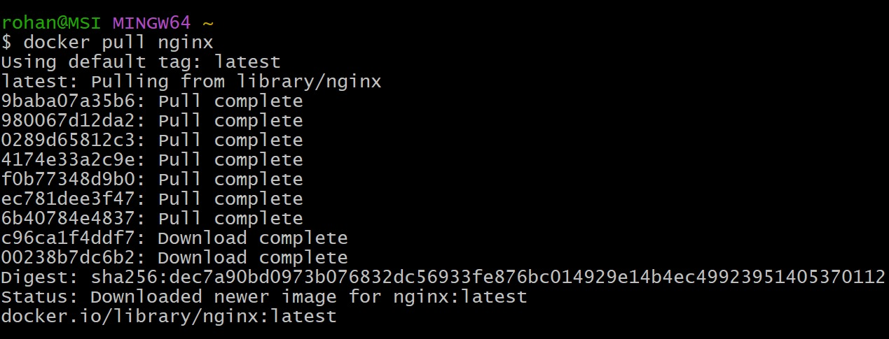

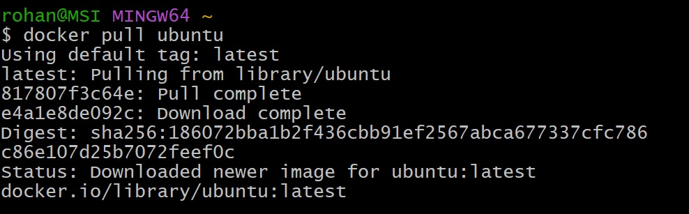

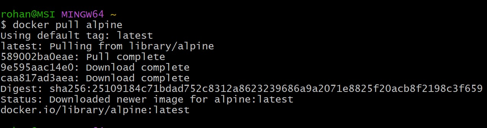

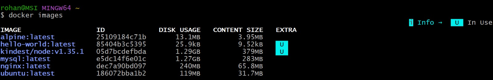

 1. Compare ubuntu vs alpine- Why is one much smaller

Ans:

- Alpine is tiny(13.1MB) Vs Ubuntu(119MB) because it uses musl libc, BusyBox, and includes minimal tools designed for containers. 

- Ubuntu ships with full GNU tools, glibc and extras for general use.

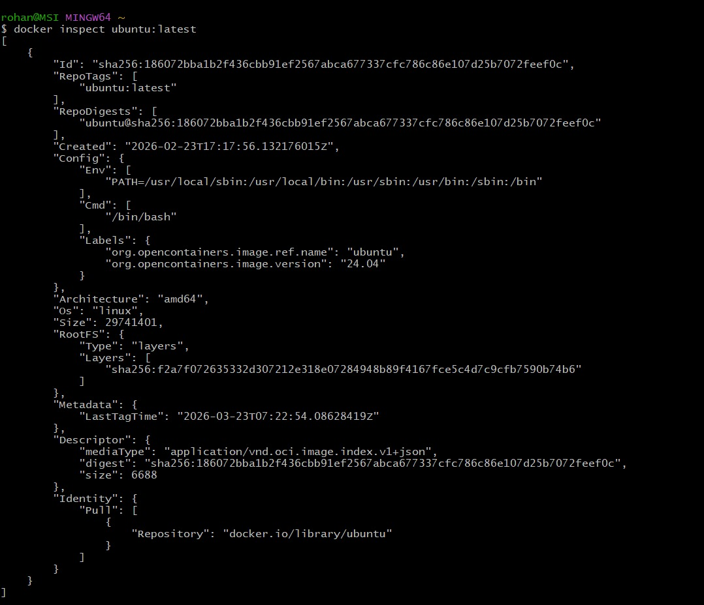

### Task 2: Image Layers

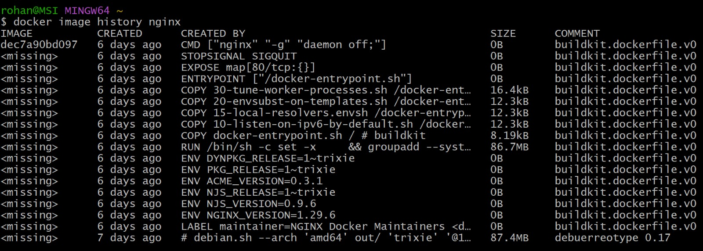

 2. What do you see?

Ans: 
- The base layer is debian:trixie (87.4MB)
- Followed by RUN and COPY commands adding config/scripts
- Final layers set env vars, expose port 80, and set entrypoint
- Most layers are small (KB), except the base OS layer
- This helps you optimize images — e.g., combine RUN commands or remove unnecessary files to reduce size.

 3. Write in your notes: What are layers and why does Docker use them?

Ans:
- Docker uses layers to break down images into reusable, read-only components. 

- This allows efficient storage and faster builds by reusing unchanged layers across multiple images, minimizing disk usage and speeding up deployment.

### Task 3: Container Lifecycle

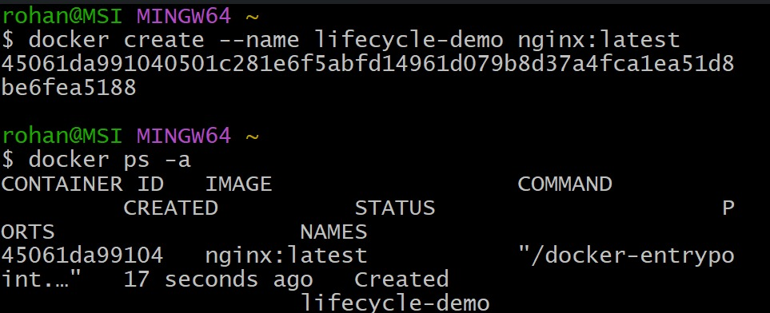

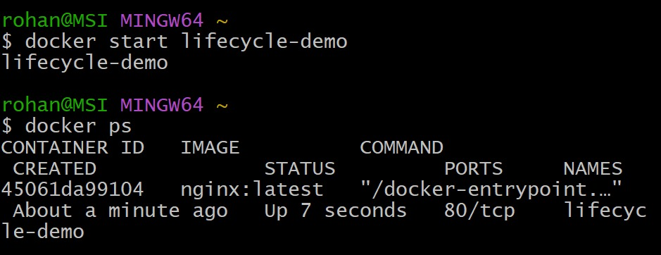

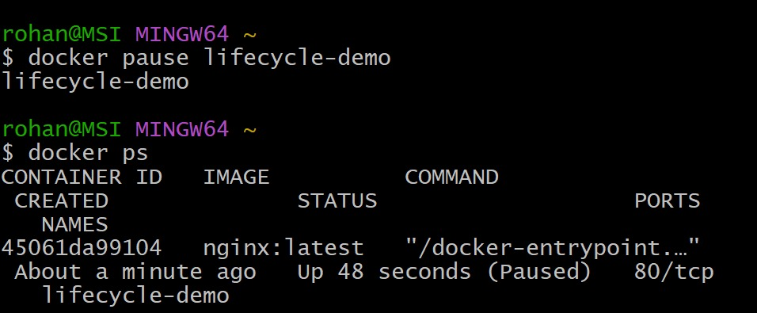

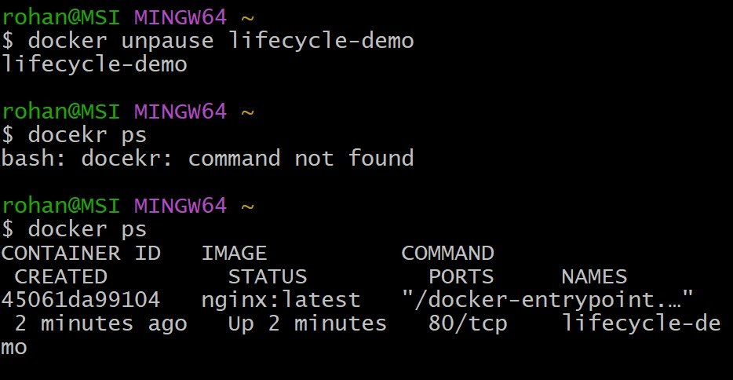

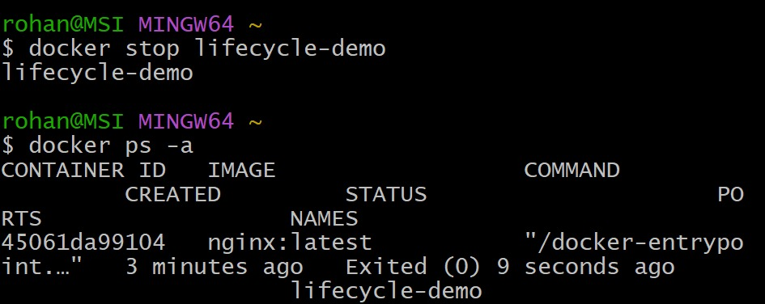

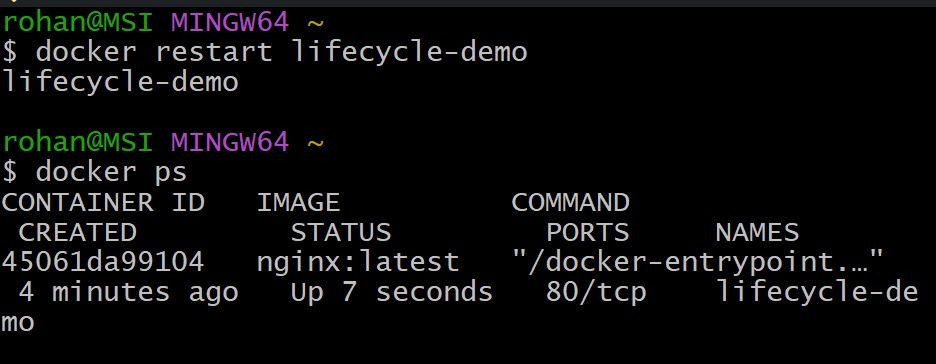

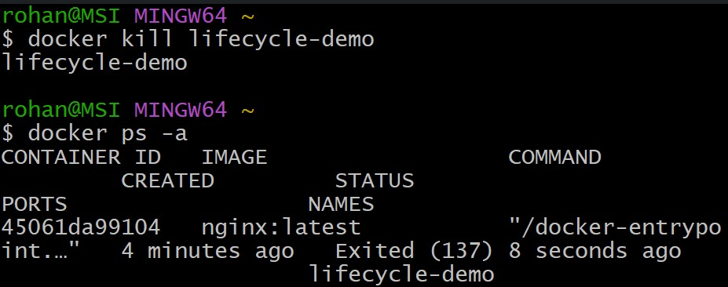

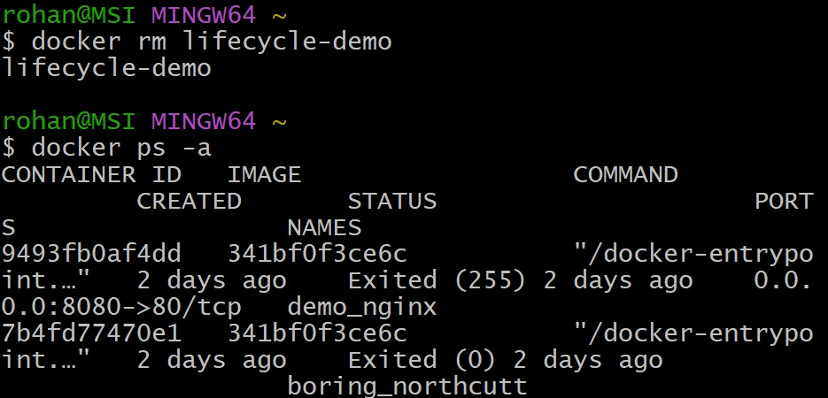

### Task 4: Working with Running Containers

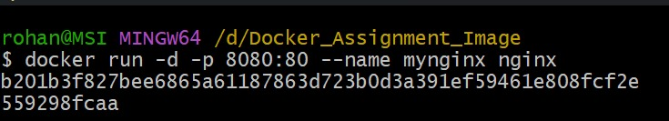

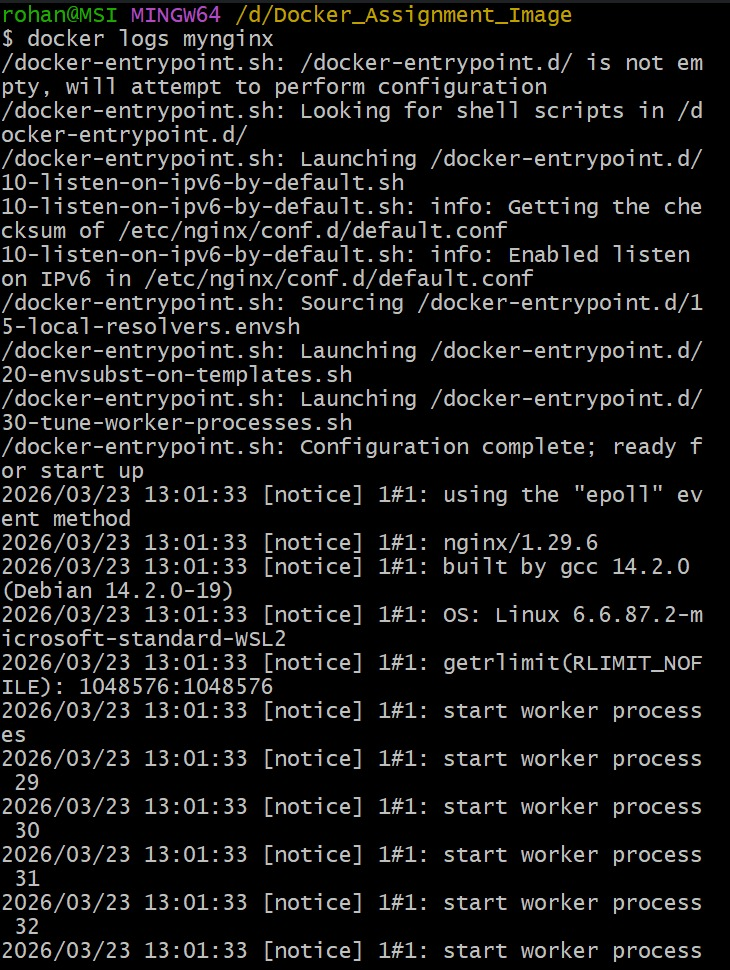

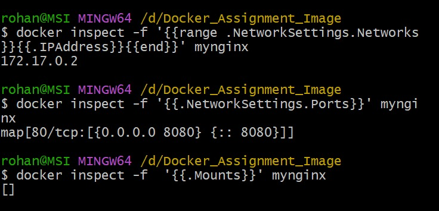

### Task 5: Clean up

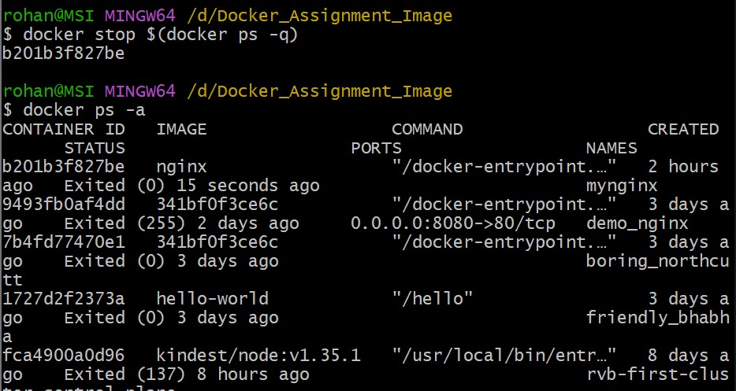

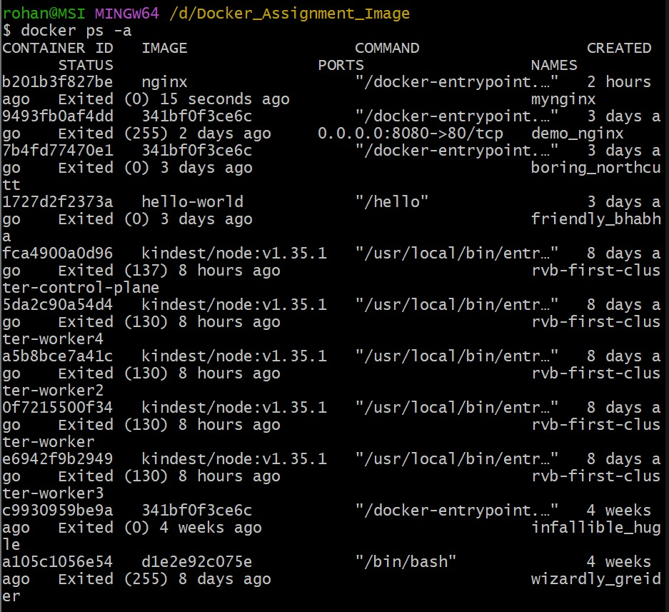

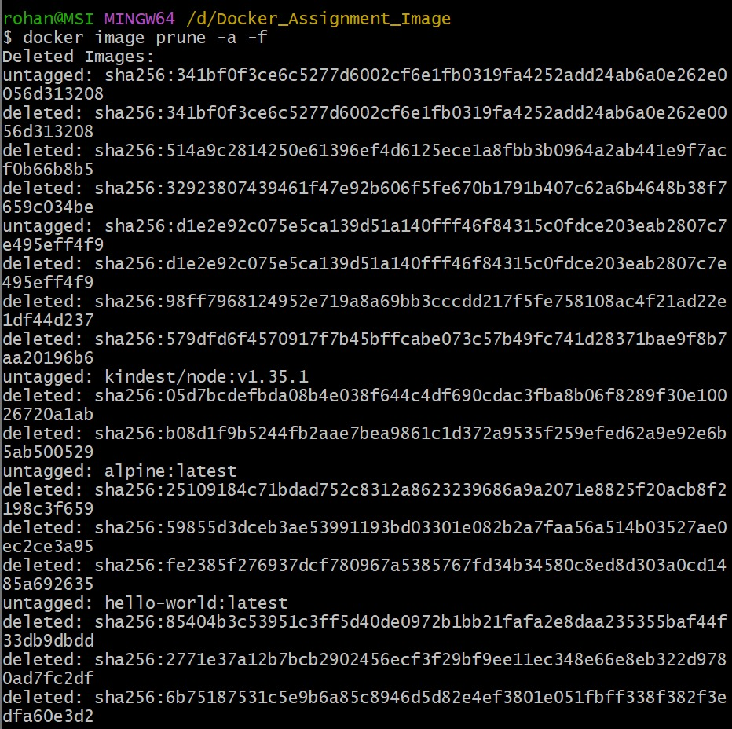

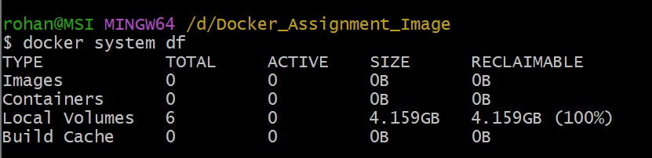

