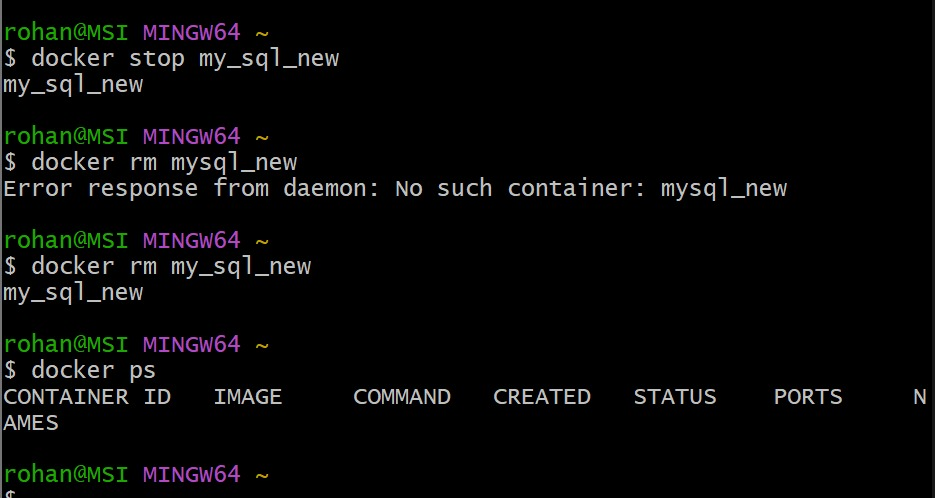
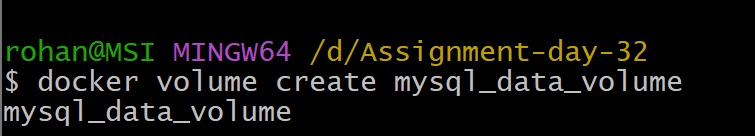
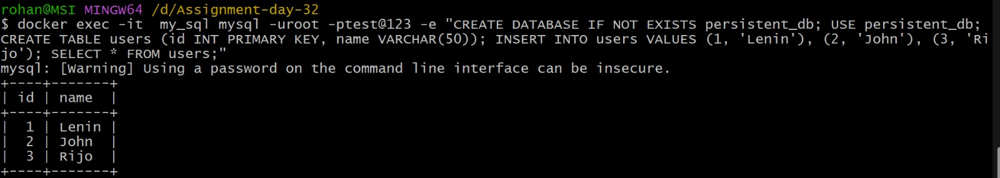
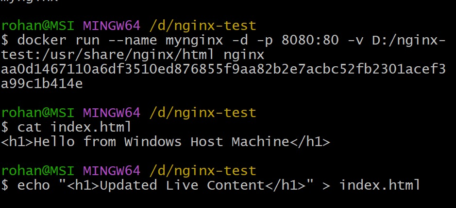
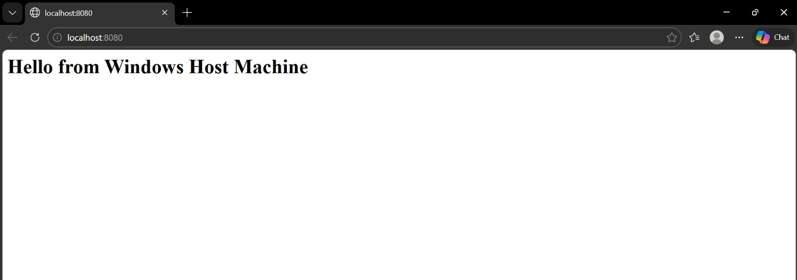
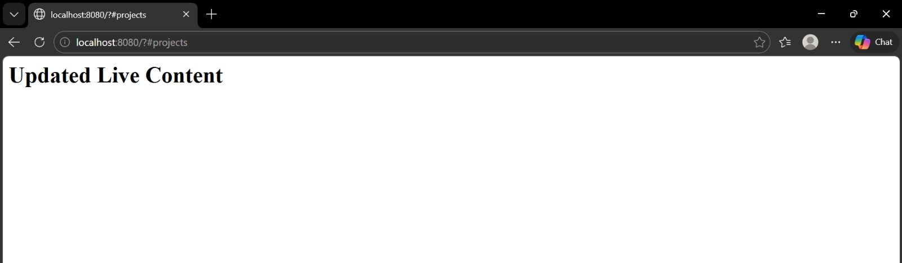
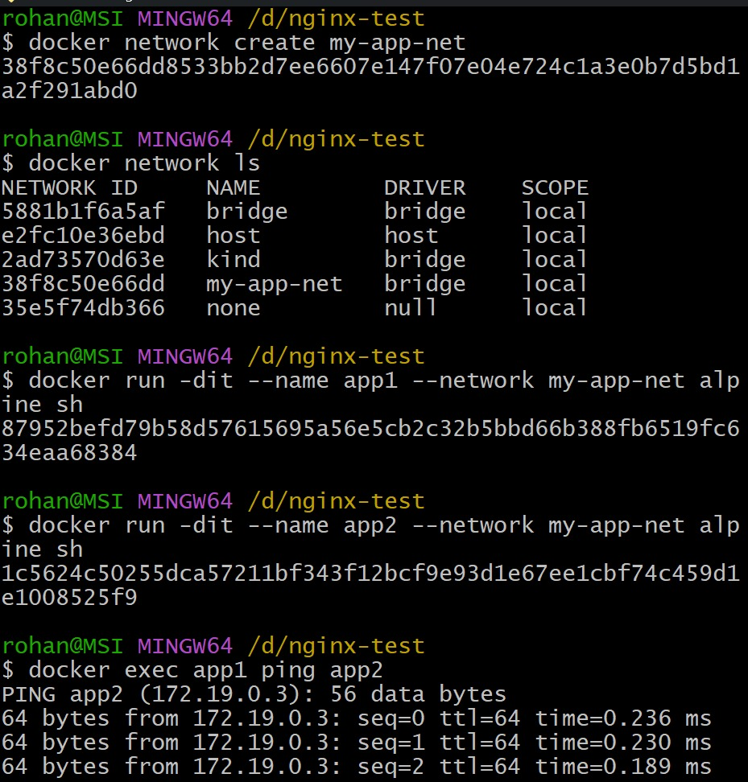
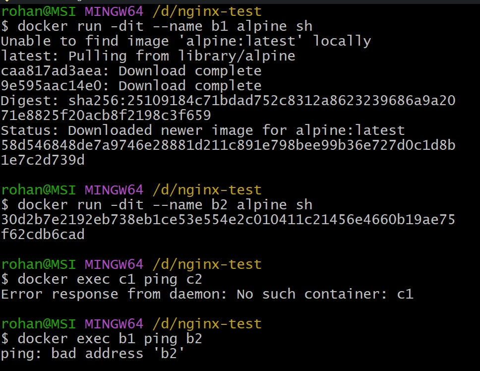
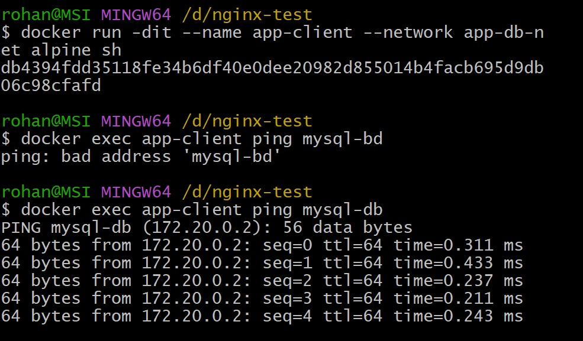
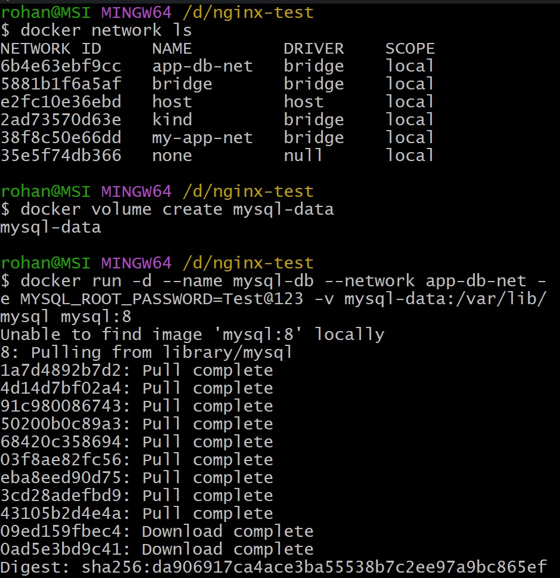

# Day 32 – Docker Volumes & Networking

## Task
Today's goal is to **solve two real problems: data persistence and container communication**.

Containers are ephemeral — they lose data when removed. And by default, containers can't easily talk to each other. Today you fix both.

---

## Expected Output
- A markdown file: `day-32-volumes-networking.md`
- Screenshots of your experiments

---

## Challenge Tasks

### Task 1: The Problem
1. Run a Postgres or MySQL container
2. Create some data inside it (a table, a few rows — anything)
3. Stop and remove the container
4. Run a new one — is your data still there?

Write what happened and why.
- What happened
Ans:
- we get an error -  Unknown database 'demobd'. my data is gone.

- Why?
Ans:
- When you remove a container, its filesystem is deleted.
- The data was stored in the container's writable layer, not persisted anywhere.
- To keep data between container restarts, we need volumes.

![]
---

### Task 2: Named Volumes
1. Create a named volume
2. Run the same database container, but this time **attach the volume** to it
3. Add some data, stop and remove the container
4. Run a brand new container with the **same volume**
5. Is the data still there?

Ans: Yes the data is intact

**Verify:** `docker volume ls`, `docker volume inspect`

---

### Task 3: Bind Mounts
1. Create a folder on your host machine with an `index.html` file
2. Run an Nginx container and **bind mount** your folder to the Nginx web directory
3. Access the page in your browser
4. Edit the `index.html` on your host — refresh the browser

Write in your notes: What is the difference between a named volume and a bind mount?

Ans: Named volume: A named volume is storage mangaed by Docker itself.

- It store it in its own internal location
- Easier to backup, move, and reuse across containers
- Best for Databases, Production data, Persistent app storage

- Bind Mount: A bind mount directly maps a folder file from your host machine into the container.

- It uses exact host path
- Chanes on host appear instantly inside container.
- Less portable because path must exist on every machine.-
- Best for Development, Editing source code live, Sharing config files.

---

### Task 4: Docker Networking Basics
1. List all Docker networks on your machine
2. Inspect the default `bridge` network
3. Run two containers on the default bridge — can they ping each other by **name**?
4. Run two containers on the default bridge — can they ping each other by **IP**?

---

### Task 5: Custom Networks
1. Create a custom bridge network called `my-app-net`
2. Run two containers on `my-app-net`
3. Can they ping each other by **name** now?
4. Write in your notes: Why does custom networking allow name-based communication but the default bridge doesn't?

- 4. Why does custom networking allow name-based communication but the default bridge doesn't?

Ans: Default bridge network
- Uses basic Layer 2 bridge connectivity only
- containers get IP addresses
- No automatic DNS server for container names
- Containers must communicate using IP addresses unless links/manul hosts are used

- Custom bridge network
- Docker create an embeded DNS service
- Every container name becomes resolvable automatically
- Containers can discover each other by name
- Better isolation and service grouping

---

### Task 6: Put It Together
1. Create a custom network
2. Run a **database container** (MySQL/Postgres) on that network with a volume for data
3. Run an **app container** (use any image) on the same network
4. Verify the app container can reach the database by container name

---

## Hints
- Volumes: `docker volume create`, `-v volume_name:/path`
- Bind mount: `-v /host/path:/container/path`
- Networking: `docker network create`, `--network`
- Ping: `docker exec container1 ping container2`

---

## Submission
1. Add your `day-32-volumes-networking.md` to `2026/day-32/`
2. Commit and push to your fork

---

## Learn in Public
Share what happened when you deleted a container without a volume on LinkedIn. The "aha moment" is real.

`#90DaysOfDevOps` `#DevOpsKaJosh` `#TrainWithShubham`

Happy Learning!
**TrainWithShubham**

