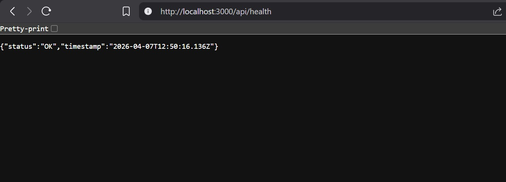
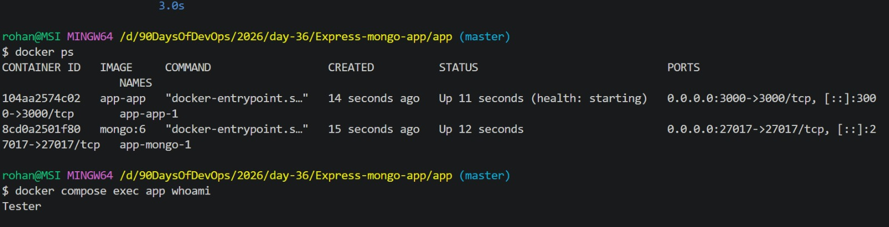
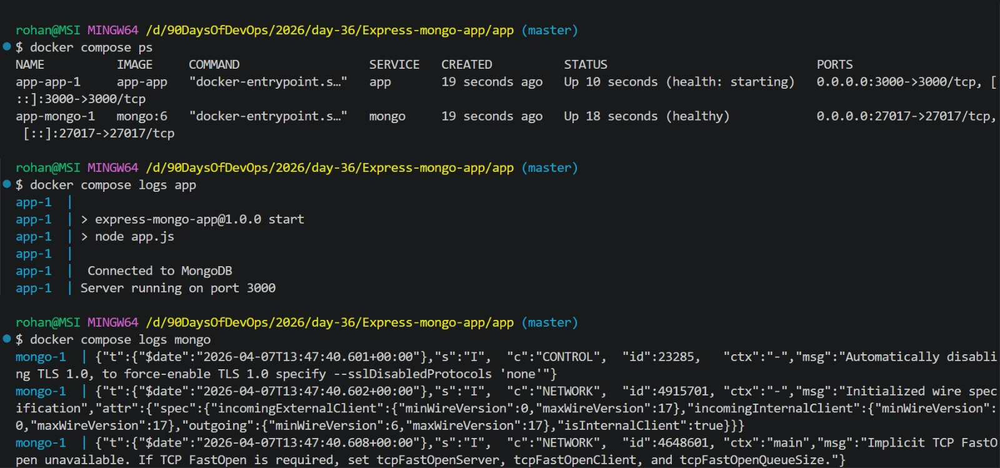
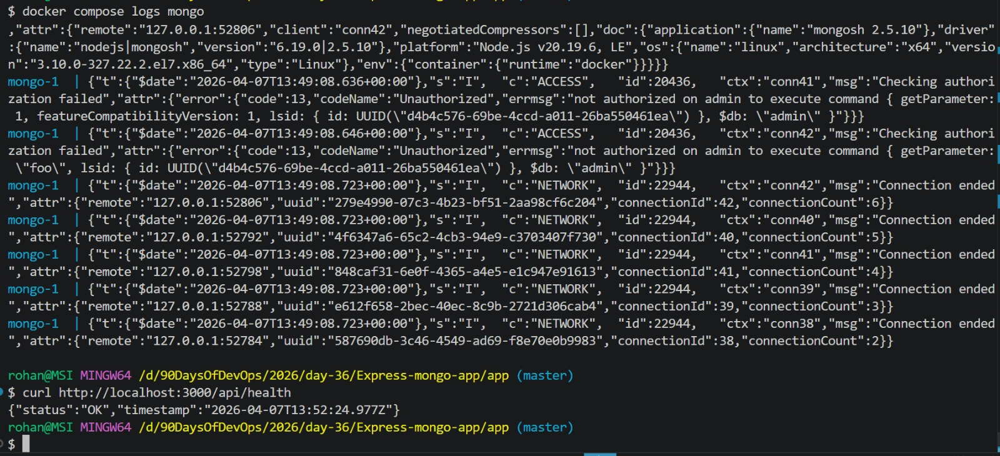
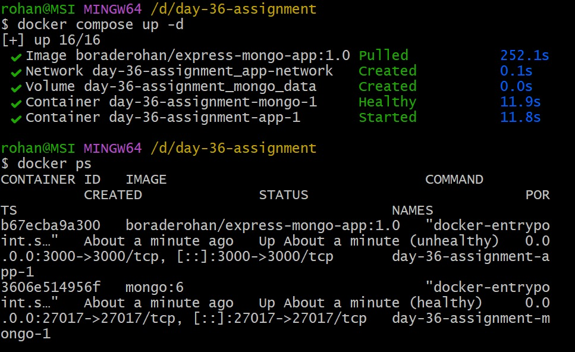

# Day 36 – Docker Project: Dockerize a Full Application

## Task
Today's goal is to **take a real application and Dockerize it end-to-end**.

No tutorials. No hand-holding. Pick an app, write the Dockerfile, set up Compose, and ship it. This is what you'll do on the job.

---

## Expected Output
- A markdown file: `day-36-docker-project.md`
- Complete project with Dockerfile, docker-compose.yml, and app code
- Image pushed to Docker Hub

---

## Challenge Tasks

### Task 1: Pick Your App
Choose **one** of these (or use your own project):
- A **Python Flask/Django** app with a database
- A **Node.js Express** app with MongoDB
- A **static website** served by Nginx with a backend API
- Any app from your GitHub that doesn't have Docker yet

If you don't have an app, clone a simple open-source one and Dockerize it.

---

### Task 2: Write the Dockerfile
1. Create a Dockerfile for your application
2. Use a **multi-stage build** if applicable
3. Use a **non-root user**
4. Keep the image **small** — use alpine or slim base images
5. Add a `.dockerignore` file

Build and test it locally.

---

### Task 3: Add Docker Compose
Write a `docker-compose.yml` that includes:
1. Your **app** service (built from Dockerfile)
2. A **database** service (Postgres, MySQL, MongoDB — whatever your app needs)
3. **Volumes** for database persistence
4. A **custom network**
5. **Environment variables** for configuration (use `.env` file)
6. **Healthchecks** on the database

Run `docker compose up` and verify everything works together.

---

### Task 4: Ship It
1. Tag your app image
2. Push it to Docker Hub
3. Share the Docker Hub link
4. Write a `README.md` in your project with:
   - What the app does
Ans: This is a Node.js/Express app that uses MongoDB and does the following:

## Main Features:
- Health check endpoint (GET /api/health) — Sends back a JSON response with the status "OK" and the current time. 
- This is usually done to make sure the app is working.

-MongoDB connection: At startup, it connects to a MongoDB database using the MONGODB_URI environment variable or defaults to mongodb://mongo:27017/myapp.
- The Express server runs on port 3000 and can handle JSON requests.
## Infrastructure (Docker and Docker Compose):
- Dockerfile packages the app in a Node.js Alpine container, installs the dependencies, and starts the server.
- docker-compose.yml — Manages two services:
- app: Your Express server with volume mounts that let you reload code while you work on it. 
- mongo: A MongoDB database service with persistent storage.

   - How to run it with Docker Compose
Ans: docker compose up
- This starts both the Express app (port 3000) and MongoDB (port 27017). Access the health check at http://localhost:3000/api/health.

To run in background: docker-compose up -d

   - Any environment variables needed
Ans: The only environment variable you need is:

- MONGODB_URI tells you what the MongoDB connection string is.

- In your docker-compose file.yml, it's already set to:
mongodb://mongo:27017/myapp

---

### Task 5: Test the Whole Flow
1. Remove all local images and containers
2. Pull from Docker Hub and run using only your compose file
3. Does it work fresh? If not — fix it until it does

---

## Documentation
Create `day-36-docker-project.md` with:
- What app you chose and why
Ans:It's a simple Express + MongoDB app with Docker that's ready for production. It's great for:

- Learning how to use containers with full-stack Node.js
- Quick local development with live-reload

- Docker makes it easy to deploy.

- Your Dockerfile (with comments explaining each line)
Ans:
### Use lightweight Node.js Alpine imaage()
FROM node:18-alpine

### Set working directory inside container
WORKDIR /app

### Copy package.json and package-lock.json from host to container
### The * allows copying both files if they exist
COPY package*.json ./

### Install npm dependencies
RUN npm install

### Copy entire application code into container
COPY . .

### Expose port 3000 (documentation only)
EXPOSE 3000

### Default command to run when container starts
CMD ["npm", "start"]

- Challenges you faced and how you solved them
Ans: Some common problems that come up when using Docker are:

- Slow builds can be fixed by changing the order of the layers in the Dockerfile so that dependencies are cached first "(for example, COPY package*.json before COPY . .)". 

- Problem with volume permissions were fixed by making sure the right person owns the files and enabling shared folders in Docker Desktop settings.
- Problems with networking were fixed by checking port usage with docker port and setting up firewalls to let Docker traffic through.
- Image bloat: This can be reduced by using multi-stage builds to leave out dependencies that are only needed at build time from the final image.
- Mismanaging environment variables: This can be fixed by passing varibales through docker run, .env files, or Dockerfile ENV directives.

- Final image size
Ans:
The final images size of the app is 236.35MB
- Docker Hub link

https://hub.docker.com/repository/docker/boraderohan/express-mongo-app/general

---

## Submission
1. Add all project files and `day-36-docker-project.md` to `2026/day-36/`
2. Commit and push to your fork

---

## Learn in Public
Share your Dockerized project on LinkedIn — include the Docker Hub link so others can pull and run it.

`#90DaysOfDevOps` `#DevOpsKaJosh` `#TrainWithShubham`

Happy Learning!
**TrainWithShubham**

