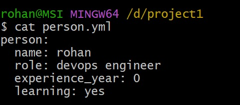
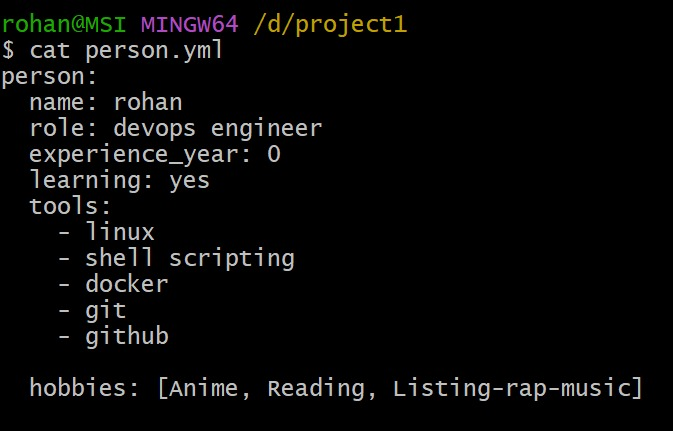
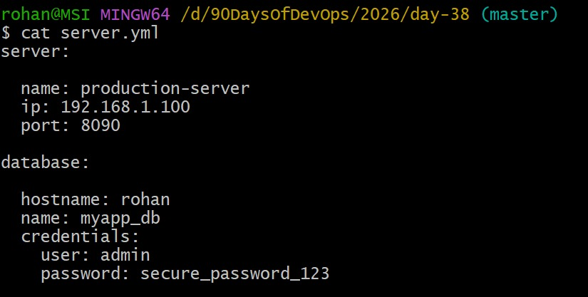
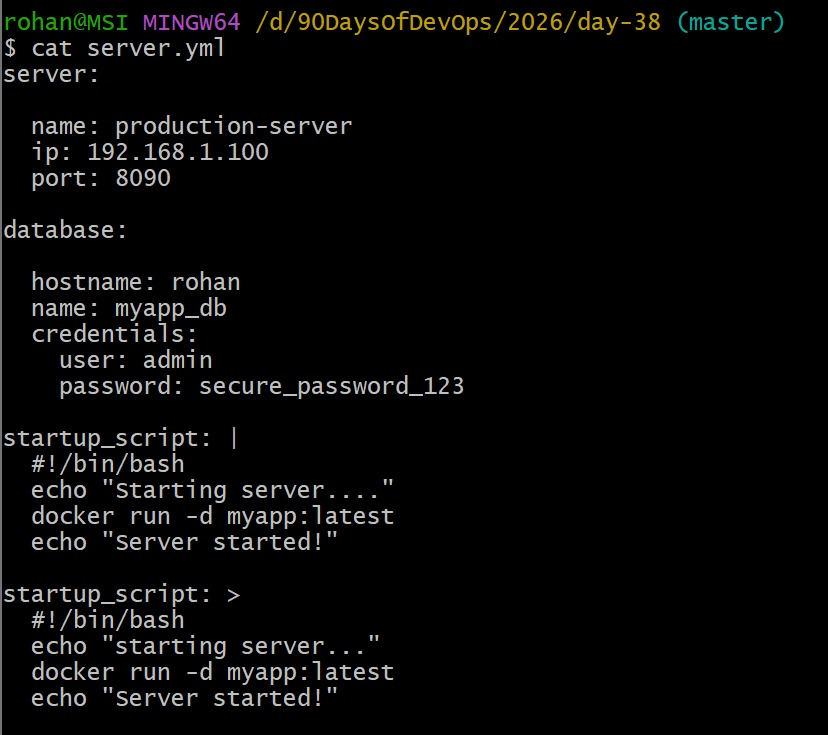
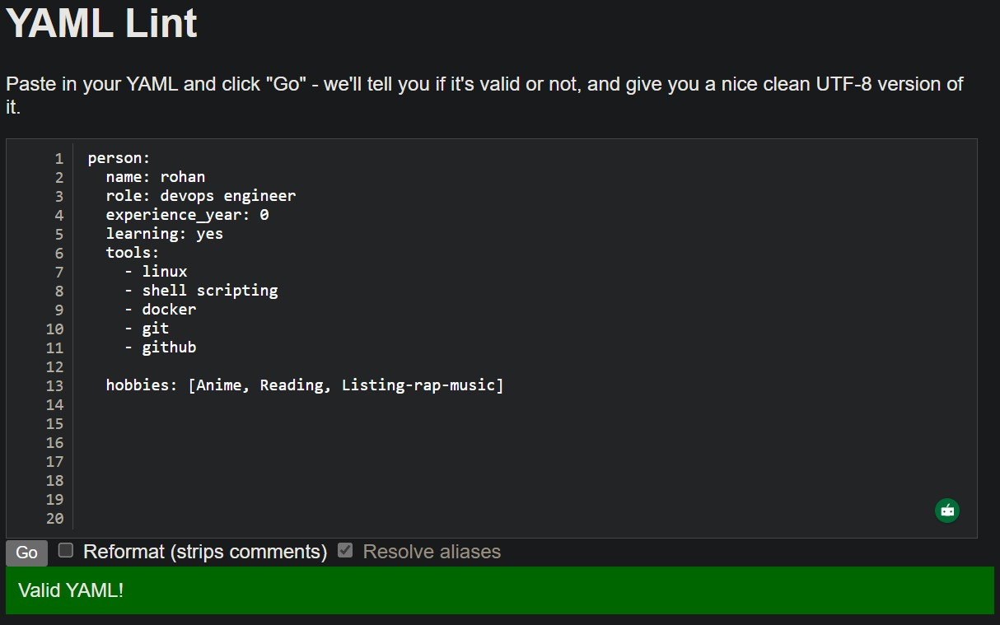
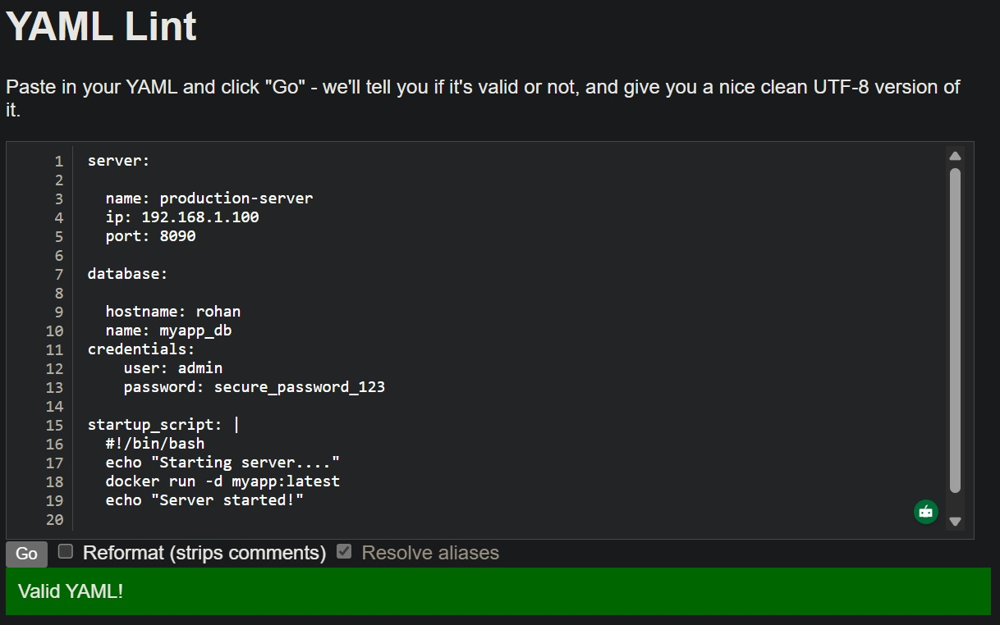

# Day 38 – YAML Basics

## Task
Before writing a single CI/CD pipeline, you need to get comfortable with **YAML** — the language every pipeline is written in.

You will:
- Understand YAML syntax and rules
- Write YAML files by hand
- Validate them

---

## Expected Output
- A markdown file: `day-38-yaml.md`
- YAML files you create during the tasks

---

## Challenge Tasks

### Task 1: Key-Value Pairs
Create `person.yaml` that describes yourself with:
- `name`
- `role`
- `experience_years`
- `learning` (a boolean)

**Verify:** Run `cat person.yaml` — does it look clean? No tabs?
Ans: yes

---

### Task 2: Lists
Add to `person.yaml`:
- `tools` — a list of 5 DevOps tools you know or are learning
- `hobbies` — a list using the inline format `[item1, item2]`

Write in your notes: What are the two ways to write a list in YAML?
Ans: The two ways to write a list in yml are:
- Block Format(mulit-line, with dashes)
- Better for readability, especially with longer lists or nested structures.
- Inline Format(single-line,with brackets)
- More compact, good for short lists or when you want everything on one line.
- Both are valid yml and produce the same result.

---

### Task 3: Nested Objects
Create `server.yaml` that describes a server:
- `server` with nested keys: `name`, `ip`, `port`
- `database` with nested keys: `host`, `name`, `credentials` (nested further: `user`, `password`)

**Verify:** Try adding a tab instead of spaces — what happens when you validate it?

---

### Task 4: Multi-line Strings
In `server.yaml`, add a `startup_script` field using:
1. The `|` block style (preserves newlines)
2. The `>` fold style (folds into one line)

Write in your notes: When would you use `|` vs `>`?
Ans: Use | (Literal Block Style) 
- when you need to keep exact newlines in scripts, config files, and code.
- It matters how you format your text (indentation, line breaks, and empty lines).
- You are writing code that can be run (bash, Python, SQL, etc.) 
- Use > (Folded Block Style) when:
- You want text that is spread out over multiple lines to become one line of text.
- Writing paragraphs that people can read (notes, descriptions, docs)
- Newlines are only there to make it easier to read.

---

### Task 5: Validate Your YAML
1. Install `yamllint` or use an online validator
2. Validate both your YAML files
3. Intentionally break the indentation — what error do you get?
Ans: Nested mappings are not allowed in compact mappings at line 5, column 13
- Implicit keys need to be on a single line at line 5, column 13
- A block sequence may not be used as an implicit map key at line 9, column 1
- Implicit keys need to be on a single line at line 9, column 5
- Implicit map keys need to be followed by map values at line 9, column 5
4. Fix it and validate again
Ans: Fixed and it was vaild yml file

---

### Task 6: Spot the Difference
Read both blocks and write what's wrong with the second one:

correct block

name: devops
tools:
  - docker
  - kubernetes

broken block

name: devops
tools:
- docker
  - kubernetes

### Problem: Indentation is inconsistent.
### YAML requires proper spacing for lists.

### Key Learnigs
1. YML uses spaces, not tabs.
2. Indentation defines the structure.
3. Lists can be written in block format (-) or Inline format([]).
