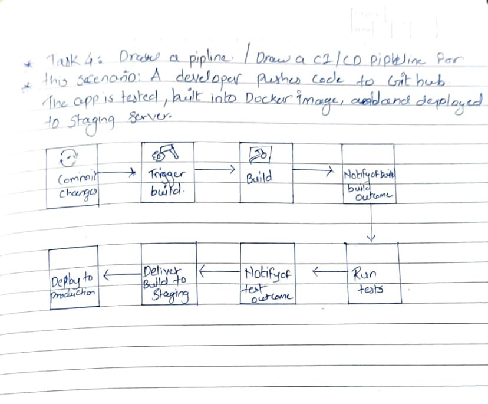

# Day 39 – What is CI/CD?

## Task
Before writing a single pipeline, understand **why CI/CD exists** and what it actually does.

Today is a research and diagram day — no pipelines yet. Get the concepts right first.

---

## Expected Output
- A markdown file: `day-39-cicd-concepts.md`
- A pipeline diagram (hand-drawn or text-based)

---

## Challenge Tasks

### Task 1: The Problem
Think about a team of 5 developers all pushing code to the same repo manually deploying to production.

Write in your notes:
1. What can go wrong?
Ans: 
- People make mistakes when they deploy (wrong commands, wrong version).
- Different environments for developers and production.
- Code that conflicts or overwrites each other's changes.
- Downtime because of wrong deployment steps.
- No plan to go back if something goes wrong.

2. What does "it works on my machine" mean and why is it a real problem?
Ans:
- It means that the code works fine on the developer's own computer but not in other places, like staging or production.
- Different operating system, dependencies, or settings
- Causes bugs that are hard to fix.
- Takes time to debug and slows down releases.

3. How many times a day can a team safely deploy manually?
Ans:
- Most of the time, only once or twice a day.
- More than that raises the risk, stress, and chances of failure.

---

### Task 2: CI vs CD
Research and write short definitions (2-3 lines each):
1. **Continuous Integration** — what happens, how often, what it catches
Ans: Continuous Integration (CI)
- Developers often (more than once a day) merge code changes into a shared repository. 
- Every time you merge, a build and test suite run automtically. 
- This catches integration bugs, broken builds, and failing test early, before they get worse
- A developer sends a feature branch to GitHub as an example from the real world.
- Within minutes, a CI piplines (like GitHub Action) runs unit tests, linting, and a build check on its own. The merge is stopped if the tests fail.

2. **Continuous Delivery** — how it's different from CI, what "delivery" means
Ans: Continuous Delivery (CD)
- Extends CI by making sure the codebase is always ready to be deployed. 
- The pipeline automatically packages and stages the release after CI pasess, but a person has to approve the final push to production.
- "Delivery" means that the artifact is ready, but it doesn't have to be live yet.

- In the real world, a docker image is built, pushed to a staging environment, and smoke-tested after CI passes.
- When the team is ready, a release manager clicks "Deploy to Production" on the pipeline dashboard.

3. **Continuous Deployment** — how it differs from Delivery, when teams use it
Ans: Continuous Deployments
- Extends the concept of Delivery by removing even the manual gates in place.
- Whenever changes pass through all the automation in the pipeline, they are released immediately into production.
- Used when having high test coverage, matured monitoring, and quick iteration is needed.
- An actual us case scenario involves developers merging a fix for a bug. 
- After running tests through CI, the changes are automatically staged using CD, and then deployed in less than 10 minutes.

---

### Task 3: Pipeline Anatomy
A pipeline has these parts — write what each one does:
- **Trigger** — what starts the pipeline
- What activates the pipeline? Trigger refers to an event that initiates the workflow automatically - either a push of new code, a pull request, a schedule, or clicking a button. Otherwise, no trigger means no pipeline execution.
- **Stage** — a logical phase (build, test, deploy)
- A step in the pipeline. Stages are sequential(each following the previous one) and consist of similar jobs.
- Some typical stages include Build Test Deploy.
- For a stage to succeed, all of its jobs must be completed successfully.

- **Job** — a unit of work inside a stage
- A piece of work within a stage. 
- A job is an independent piece of work that executes on the runner and may succeed or fail. 
- Jobs within a stage execute in parallel, While jobs from different stages execute sequentially.

- **Step** — a single command or action inside a job
- A command or action executed within a jobs.
- Steps are the smallest units of work, they are always sequential and will stop if a step fails. 
- A step may be a shell command, a script, or even a pre-made action.
- **Runner** — the machine that executes the job
- The computer running the task.
- The runner is a computer or server (hosted by the provider or self-hosted) that will launch the runner, clone the repository, run all the steps, and send notifications back.

- **Artifact** — output produced by a job
- The output created from the job, such as logs, binaries, and any other files that will be retained and can be used by following task.

---

### Task 4: Draw a Pipeline
Draw a CI/CD pipeline for this scenario:
> A developer pushes code to GitHub. The app is tested, built into a Docker image, and deployed to a staging server.

Include at least 3 stages. Hand-drawn and photographed is perfectly fine.

---

### Task 5: Explore in the Wild
1. Open any popular open-source repo on GitHub (Kubernetes, React, FastAPI — pick one you know)
2. Find their `.github/workflows/` folder
3. Open one workflow YAML file
4. Write in your notes:
   - What triggers it?
Ans: workflow_dispatch- This workflow is manually triggered.
- The push trigger is commented out, so it only runs when someone manually clicks the "Run workflow" button in the GitHub Actions UI.
   - How many jobs does it have?

Ans: Job- There is a single job called deploy that runs on ubuntu-latest.

   - What does it do? (best guess)

Ans: This workflow automatically deploys a static portfolio website to GitHub Pages.
- Checkout Code- Clones the repository code using the actions/checkout@v4 action
- Setup GitHub Pages- Configures GitHub Pages setting using actions/configure-pages@v4
- Uploads static files- Packages all files in the repo (path: ".") as artifacts using actions/uploads-pages-artifact@v4
- Deploy to GitHub Pages- Publishes the artifact live using action/deploy-pages@v4, which outputs the live pages URL 
- Key permission: The workflow has write access to GitHub Pages and ID tokens, plus read access to repository contents. 

