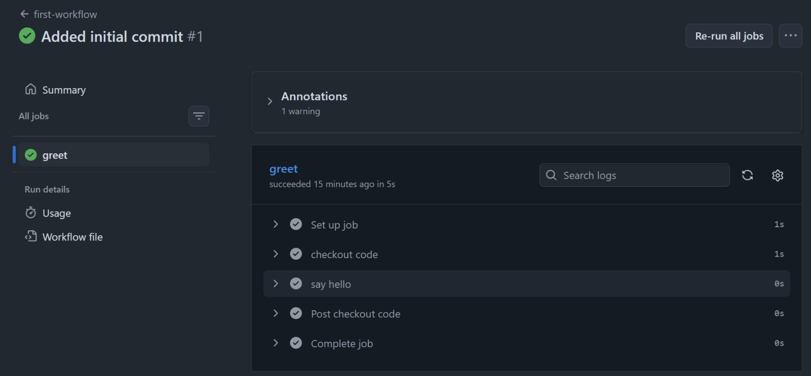

### Task 2: Hello Workflow
Create `.github/workflows/hello.yml` with a workflow that:
1. Triggers on every `push`
2. Has one job called `greet`
3. Runs on `ubuntu-latest`
4. Has two steps:
   - Step 1: Check out the code using `actions/checkout`
   - Step 2: Print `Hello from GitHub Actions!`

Push it. Go to the **Actions** tab on GitHub and watch it run.

**Verify:** Is it green? Click into the job and read every step.

### Task 3: Understand the Anatomy
Look at your workflow file and write in your notes what each key does:
- `on:` It trigger - when to run
- `jobs:` Container for all jobs
- `runs-on:` Which machine to use
- `steps:` Ordered list of things to do 
- `uses:` Use a pre-built action from market place
- `run:` Excute a raw shell command
- `name:` Human readable label for the step

### Task 5: Break it on purpose

What does a failed pipeline look like? How do you read the error?

Ans:
- A failed pipeline shows a red cross next to the commit message in the Actions tab, while a successful one shows green tick. 
- To find where it broke, click into the workflow run and scan the steps for the first red cross — that's where the pipeline stopped. 
- Expand that step and read the logs, especially the last few lines, where the error message usually appears. 
- If you see exit code 0 it means success, and exit code 1 means something went wrong."
