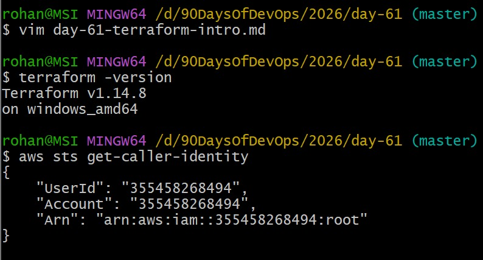
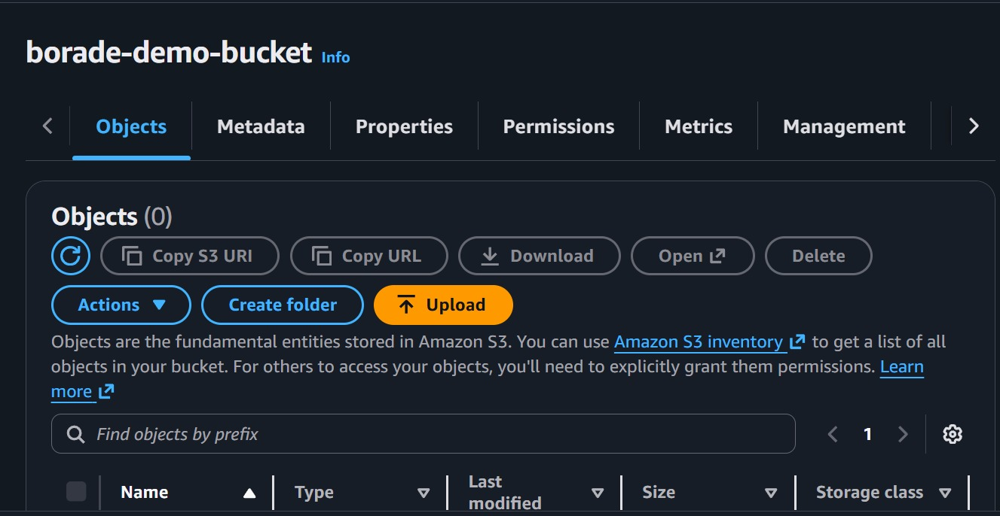
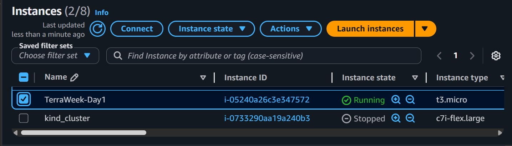
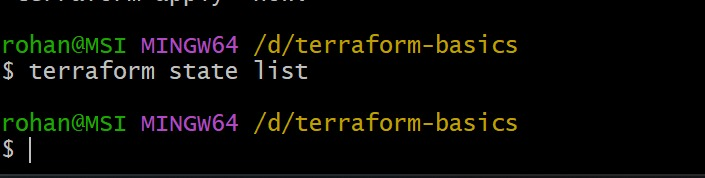
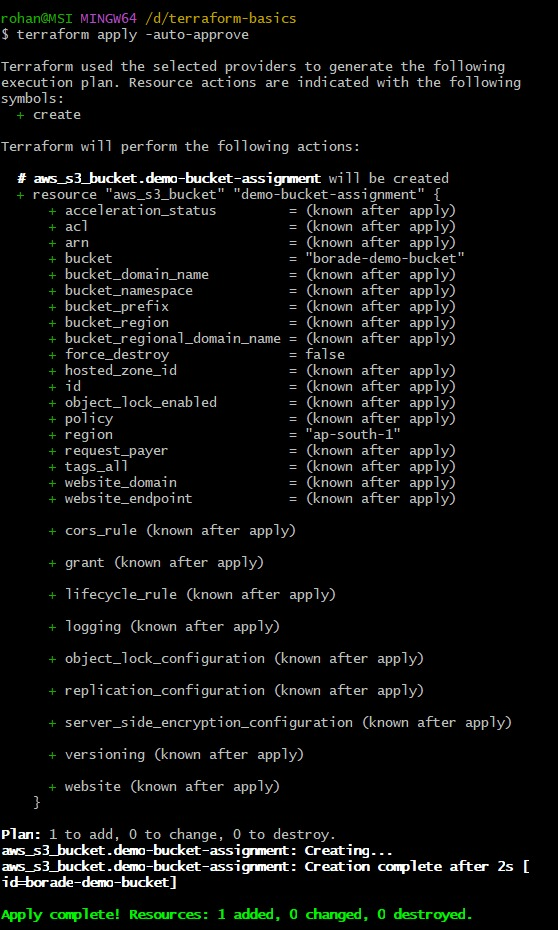
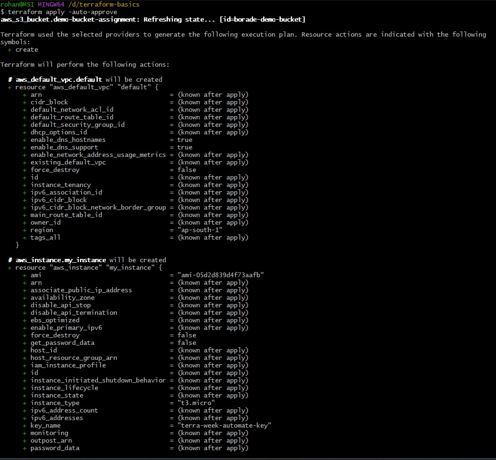
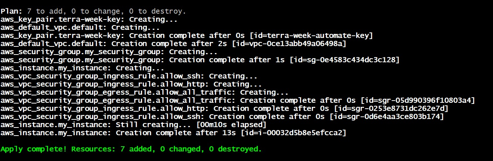

# Day 61 -- Introduction to Terraform and Your First AWS Infrastructure

## Task
You have been deploying containers, writing CI/CD pipelines, and orchestrating workloads on Kubernetes. But who creates the servers, networks, and clusters underneath? Today you start your Infrastructure as Code journey with Terraform -- the tool that lets you define, provision, and manage cloud infrastructure by writing code.

By the end of today, you will have created real AWS resources using nothing but a `.tf` file and a terminal.

---

## Expected Output
- Terraform installed and working on your machine
- AWS CLI configured with valid credentials
- An S3 bucket and EC2 instance created and destroyed via Terraform
- A markdown file: `day-61-terraform-intro.md`

---

## Challenge Tasks

### Task 1: Understand Infrastructure as Code
Before touching the terminal, research and write short notes on:

1. What is Infrastructure as Code (IaC)? Why does it matter in DevOps?

Ans: Infrastructure as Code (IaC) is a new DevOps method that uses code to automatically set up and manage servers, networks, and cloud resources instead of having to do it by hand.
- It helps keep deployments consistent, fast, and reliable.- Uses scripts or configuration files to set up infrastructure automatically
- Makes sure that the environments are the same for development, testing, and production.
- Makes deployments faster and easier to repeat.
- Lowers the number of mistakes people make when setting things up by hand.
- Helps keep track of changes to infrastructure.
- It treats parts of infrastructure like software, so you can use software development techniques like version control, testing, and CI/CD pipelines.

2. What problems does IaC solve compared to manually creating resources in the AWS console?

Ans:Infrastructure as Code (IaC) vs. Managing AWS Console by Hand
- Main issues IaC fixes:- Consistency and reproducibility: It's easy to make mistakes and hard to copy when you click on the console by hand. IaC makes sure that the infrastructure is always the same, so there are no "it works on my machine" problems in different environments.
- Speed and Scalability: It takes hours to manually provision 100 resources; Iac does it in minutes. Scaling is easy.
- Version control and auditability: Git keeps track of changes to infrastructure, showing who made what changes and when. There is no audit trail for manual changes.
- Disaster Recovery: Did you lose your infrastructure? Instead of having to remember everything and recreate it by hand, redeploy from code in minutes.
- Collaboration: Instead of hoping that someone writes down the steps for manual changes, teams can review infrastructure changes through pull requests before they are deployed.

3. How is Terraform different from AWS CloudFormation, Ansible, and Pulumi?

Ans: 
- Terraform
- Uses HCL, which stands for HashiCorp Configuration Language
- Works with more than one cloud provider (AWS, Azure, GCP)
- Best for setting up infrastructure

- CloudFormation for AWS
- IaC tool that works with AWS
- Works with JSON and YAML
- Works best with AWS services only

- Ansible
- Mostly for managing and automating settings
- Uses playbooks written in YAML
- Best for managing configurations, installing software, and updating servers

- Pulumi
- Works with real programming languages like Python, JavaScript, and Go
- Works with more than one cloud, like Terraform
- Best for developers who like coding more than declarative syntax.

4. What does it mean that Terraform is "declarative" and "cloud-agnostic"?

Ans: 
- Terraform is declarative because users tell it what they want the final state of the infrastructure to be, and Terraform figuresout how to get there on its own. 
- It's cloud-agnostic because the same Terraform language can handleresources on different cloud platforms, which makes it flexible and easy to move.

Write this in your own words -- not copy-pasted definitions.

---

### Task 2: Install Terraform and Configure AWS
1. Install Terraform:
```bash
# macOS
brew tap hashicorp/tap
brew install hashicorp/tap/terraform

# Linux (amd64)
wget -O - https://apt.releases.hashicorp.com/gpg | sudo gpg --dearmor -o /usr/share/keyrings/hashicorp-archive-keyring.gpg
echo "deb [signed-by=/usr/share/keyrings/hashicorp-archive-keyring.gpg] https://apt.releases.hashicorp.com $(lsb_release -cs) main" | sudo tee /etc/apt/sources.list.d/hashicorp.list
sudo apt update && sudo apt install terraform

# Windows
choco install terraform
```

2. Verify:
```bash
terraform -version
```

3. Install and configure the AWS CLI:
```bash
aws configure
# Enter your Access Key ID, Secret Access Key, default region (e.g., ap-south-1), output format (json)
```

4. Verify AWS access:
```bash
aws sts get-caller-identity
```


You should see your AWS account ID and ARN.

---

### Task 3: Your First Terraform Config -- Create an S3 Bucket
Create a project directory and write your first Terraform config:

```bash
mkdir terraform-basics && cd terraform-basics
```

Create a file called `main.tf` with:
1. A `terraform` block with `required_providers` specifying the `aws` provider
2. A `provider "aws"` block with your region
3. A `resource "aws_s3_bucket"` that creates a bucket with a globally unique name

Run the Terraform lifecycle:
```bash
terraform init      # Download the AWS provider
terraform plan      # Preview what will be created
terraform apply     # Create the bucket (type 'yes' to confirm)
```

Go to the AWS S3 console and verify your bucket exists.

**Document:** 
- What did `terraform init` download?

Ans:
- Initializing the backend, Initializing provider plugins.
- Finding latest version of hashi corp/aws
- Installed hashicorp/aws v6.39.0
- Terraform has created a lock file. .terraform.lock.hcl to record the selection it made above.

- What does the `.terraform/` directory contain?

Ans:
The .terraform/ directory contains providers/ directory inside this there is registry.terraform.io/ directory inside this hashicorp/ inside this aws/ directory inside this directory windows_amd64/ inside this directory it has License.txt file and terraform-provider-aws_v6.39.0_x5.exe*



---

### Task 4: Add an EC2 Instance
In the same `main.tf`, add:
1. A `resource "aws_instance"` using AMI `ami-0f5ee92e2d63afc18` (Amazon Linux 2 in ap-south-1 -- use the correct AMI for your region)
2. Set instance type to `t2.micro`
3. Add a tag: `Name = "TerraWeek-Day1"`

Run:
```bash
terraform plan      # You should see 1 resource to add (bucket already exists)
terraform apply
```
Go to the AWS EC2 console and verify your instance is running with the correct name tag.

**Document:** How does Terraform know the S3 bucket already exists and only the EC2 instance needs to be created?

- How does Terraform know the s3 bucker already exists and only the EC2 instance needs to created?

Ans: Terraform knows this because it looks at your configuration, Terraform state, and the real infrastructure in Amazon Web Services.
- Terraform reads your.tf file → sees an EC2 instance and an S3 bucket
- Terraform looks at the state file (terraform.tfstate) and writes down what it already controls.
- Terraform compares the real resources in AWS
- Terraform doesn't do anything for an S3 bucket if it already exists in the state and matches AWS.
- Terraform plans to make only EC2 if EC2 is not there.



---

### Task 5: Understand the State File
Terraform tracks everything it creates in a state file. Time to inspect it.

1. Open `terraform.tfstate` in your editor -- read the JSON structure
2. Run these commands and document what each returns:
```bash
terraform show                          # Human-readable view of current state
terraform state list                    # List all resources Terraform manages
terraform state show aws_s3_bucket.<name>   # Detailed view of a specific resource
terraform state show aws_instance.<name>
```

3. Answer these questions in your notes:
  - What information does the state file store about each resource?

Ans: The Terraform state file (terraform.tfstate) stores details about every managed resource so Terraform can track infrastructure correlctly.
- Type of resource: aws_s3_bucket, aws_instance, etc.
Name of the resource: a local Terraform name like my_bucket
- Resource ID: the real cloud ID that Amazon Web Services gives you
- Attributes are things like the name of the bucket, the region, and the type of instance.
- Dependencies are the resources that rely on other resources.
-Current state: if the resource already exists or has changed. 

   - Why should you never manually edit the state file?

Ans: You should never manually edit the Terraform state file because it can easily corrupt Terraform's understanding of your infrastructure.
- Terraform can lose track of resources if you make a small mistake.
- Incorrect values could lead to unwanted actions like creating, updating, or destroying.
- Resource IDs can get messed up.
- Dependencies might break
- It can make Terraform and Amazon Web Services drift apart.

   - Why should the state file not be committed to Git?

Ans: The Terraform state file should usually not be committed to GitHub/Git because it can contain sensitive and changing data.
- It could keep private data like resource IDs, IPs, and even secrets.
- It changes a lot, which leads to Git conflicts that aren't needed.
- Team members might write over each other's state.
- Infrastructure can be hurt by wrong shared state.

---

### Task 6: Modify, Plan, and Destroy
1. Change the EC2 instance tag from `"TerraWeek-Day1"` to `"TerraWeek-Modified"` in your `main.tf`
2. Run `terraform plan` and read the output carefully:
   - What do the `~`, `+`, and `-` symbols mean?

Ans: In Terraform plan, these sysmbols show what action Terraform will take on a resource.
- '~' Update/modify exisiting resource.
- '+' Create new resource.
- '-' Destroy exisiting resource.

   - Is this an in-place update or a destroy-and-recreate?

Ans: This an in-place update. 

3. Apply the change
4. Verify the tag changed in the AWS console
5. Finally, destroy everything:
```bash
terraform destroy
```
6. Verify in the AWS console -- both the S3 bucket and EC2 instance should be gone



---

## Hints
- S3 bucket names must be globally unique -- use something like `terraweek-<yourname>-2026`
- AMI IDs are region-specific -- search "Amazon Linux 2 AMI" in your region's EC2 launch wizard
- `terraform fmt` auto-formats your `.tf` files -- run it before committing
- `terraform validate` checks for syntax errors without connecting to AWS
- The `.terraform/` directory contains downloaded provider plugins
- Add `*.tfstate`, `*.tfstate.backup`, and `.terraform/` to your `.gitignore`

---

## Documentation
Create `day-61-terraform-intro.md` with:
- IaC explanation in your own words (3-4 sentences)

Ans: Instead of clicking in the Aws console, write a file that tells Terraform what infrastructure to create.
- Write a code to create infrastructure for AWS EC2 instance, AWS S3 bucket etc.

- Screenshot of `terraform apply` creating your S3 bucket and EC2 instance





- Screenshot of the resources in the AWS console
- What each Terraform command does (init, plan, apply, destroy, show, state list)

Ans:
- terraform init: initializes terraform, downloads providers and creates working files
- terraform plan: shows what terraform will create, change or destroy before executing it.
- terraform apply: applies the changes and create, change,or destroy before execution.
- terraform destroy: removes all managed resources.
- terraform show: diplays current state or resource details
- terraform state list: lists all resources stored in terraform state.

- What the state file contains and why it matters

Ans: 
- Type of resource(aws_instance)
- Name of the resource
- The real ID of a cloud resource
- Properties like the name of the bucket, the IP address, the region, and so on
- Resources that depend on each other
- Why it matters:
- Terraform checks your state against your config and the real cloud resources.
- It knows what to make, change, or get rid of.
Stops the creation of duplicate resources

---

## Submission
1. Add `day-61-terraform-intro.md` to `2026/day-61/`
2. Commit and push to your fork

---

## Learn in Public
Share on LinkedIn: "Started the TerraWeek Challenge -- installed Terraform, created my first S3 bucket and EC2 instance using code, and destroyed it all with one command. Infrastructure as Code just clicked."

`#90DaysOfDevOps` `#TerraWeek` `#DevOpsKaJosh` `#TrainWithShubham`

Happy Learning!
**TrainWithShubham**

